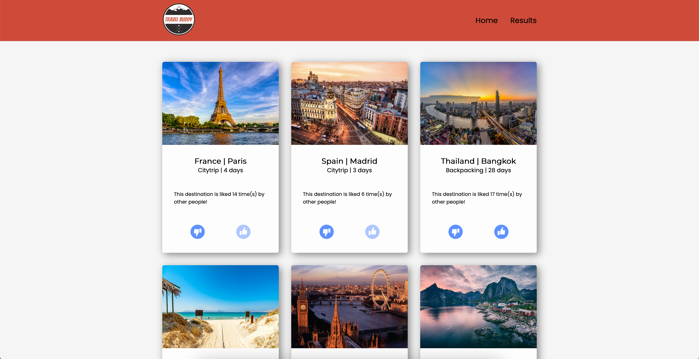
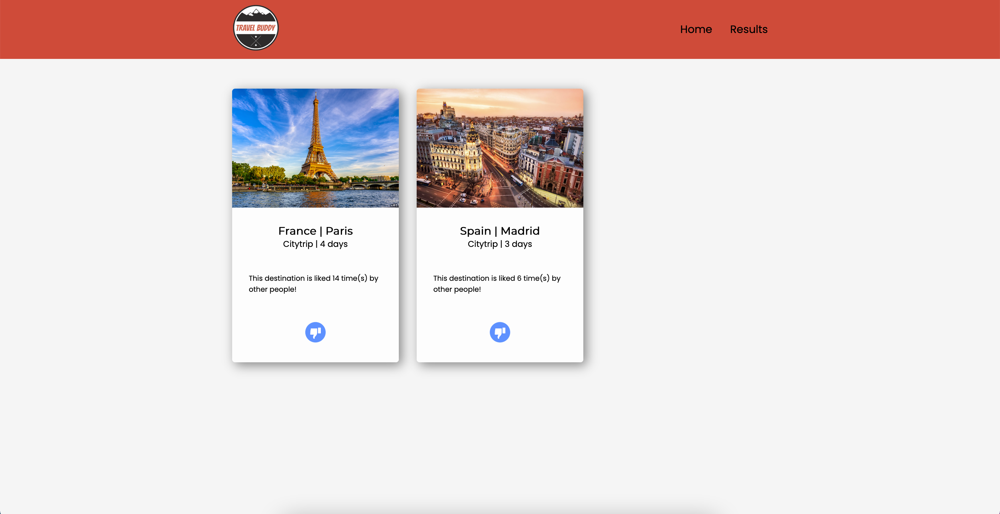
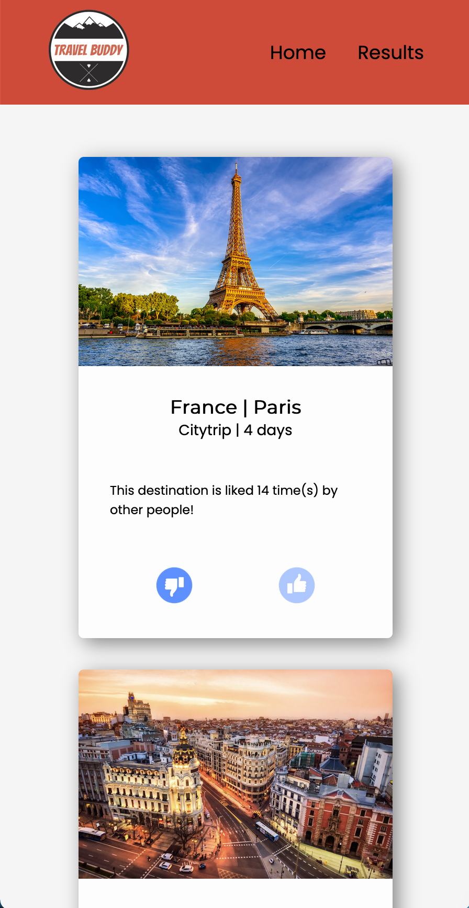

# Matching App - Travel Buddy

Travel Buddy is een app waarmee de gebruikers van de app een reispartner kunnen vinden, op basis van hun persoonlijke voorkeuren. 
Er zijn een aantal bestemmingen beschikbaar, welke de gebruikers kunnen liken en disliken. Als de gebruiker een bestemming geliked heeft kan de 
gebruiker zien welke andere gebruikers die bestemming leuk vinden, waardoor ze met elkaar in contact kunnen komen en samen naar die bestemming kunnen gaan.

Link naar de applicatie: [TravelBuddy](https://travel-buddy-tech.herokuapp.com/)

#### Een screenshot van homepagina van de app

#### Een screenshot van de resultaten pagina van de app

#### Een screenshot van de mobiele versie van de app

## Installatie
### Clonen
Om de app lokaal te laten draaien moet het project eerst lokaal worden gecloned.
Als dit stukje code gerunt wordt in de terminal wordt de repository lokaal gecloned:

`gh repo clone tomvandenberg11/ProjectTech.git`

Ga eerst naar de folder waarin je wilt dat het project gecloned wordt. Je kan in de terminal navigeren met `cd` met daar achter de map waar je heen wilt.

Daarna is het nodig om `node` en `npm` geinstalleerd te hebben op je lokale computer. Als je deze stappen gevolgd hebt, worden met `npm install` de benodigde packages gedownload.

### Database
De app heeft een database met daarin de data voor de app. Deze app gebruikt daarvoor [MongoDB](https://www.mongodb.com/).
Je hebt een account nodig om een database aan te maken. Hier kan je dan vervolgens alle gewenste data in zetten.
Als je een database hebt aangemaakt is het wel nodig om de configuratie te laten werken. In het .env file staan een aantal invoervelden die
ingevuld moeten worden:

`MONGO_USER=` gebruikersnaam MongoDB database hier

`MONGO_PASS=` wachtwoord MongoDB database hier

`MONGO_URI=` link MongoDB database hier

### Running
Als je de bovenstaande stappen gevolgd hebt kan de app opgestart worden door:

`npm run server` 

te runnen in de terminal.
Je ziet dan een bericht in de terminal staan op welke link de app te zien is.

## 

## Licence
Dit project is voorzien van een MIT licence. 

## Bronnen
Alle bronnen zijn op de pagina van het desbetreffende onderwerp gedocumenteerd.
